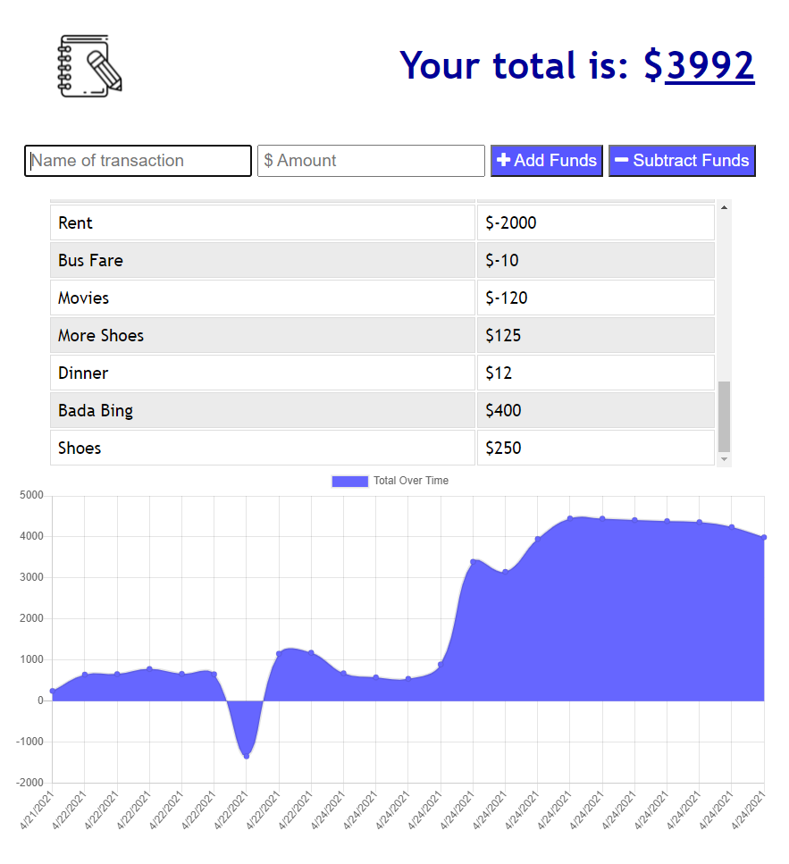

# Budget Tracker / Progressive Web App  
  

## Brief Description  
Users of this app can add expenses and deposits to their budget with or without an internet connection. When entering transactions offline, they should populate the total when brought back online.

## Table of Contents  
- [Detailed Description](#detailed-description)  
- [Business Context](#business-context)  
- [Acceptance Criteria](#acceptance-criteria)  
- [User Story](#user-story)  
- [Technology](#technology)
- [Usage](#usage)  
- [License](#licese)  
- [Questions](#questions)  

## Detailed Description

Track  Deposits and Expenses Online or Offline

This Budget Tracker application allows for offline access and functionality.

The user can add expenses and deposits to their budget with or without a connection. 

Offline Functionality:

  * Enter deposits offline

  * Enter expenses offline

When brought back online:

  * Offline entries are added to tracker.

## Business Context
Giving users a fast and easy way to track their money is important, but allowing them to access that information anytime is even more important. Having offline functionality is paramount to our applications success.

## Acceptance Criteria
GIVEN a user is on Budget App without an internet connection
WHEN the user inputs a withdrawal or deposit
THEN that will be shown on the page, and added to their transaction history when their connection is back online.  

## User Story
AS AN avid traveller  
I WANT to be able to track my withdrawals and deposits with or without a data/internet connection  
SO THAT my account balance is accurate when I am traveling  

## Technology  
- MongoDB  
- Mongoose.js  
- Morgan logger  
- Express Server  
- Node.js  
- IndexedDB

## Usage  
Enter transaction names/amounts in the input fields, and select the corresponding button to Add Funds or Subtract Funds. A table is created with a list of transactions, and your total Budget is displayed at the top of the page. There is also a chart depicting your budget trend.    
### [Link to Deployed App](https://shielded-reaches-98709.herokuapp.com/)  

## License  
View the full MIT License [here](./LICENSE)  

## Questions  
Feel free to contact me with any questions:  
[GitHub Repo](https://github.com/gregriss/budget-tracker-pwa)  
[Email me](mailto:gregriss23@gmail.com)